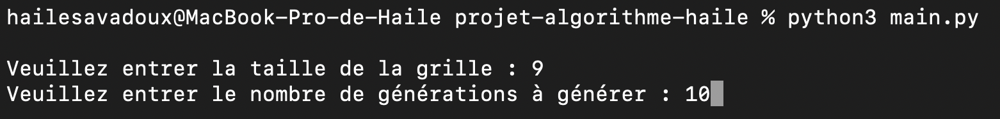
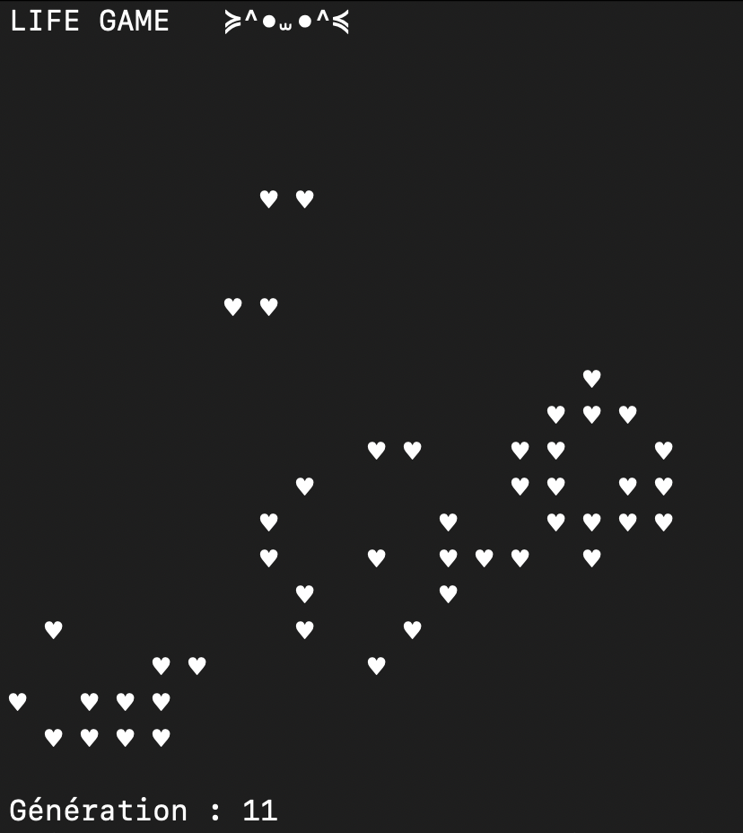

# Projet : Jeu de la Vie de Conway

Bienvenue dans mon implémentation du célèbre "Jeu de la Vie" de Conway ! ✨🦠 Ce projet simule un automate cellulaire qui évolue au fil des générations en fonction de règles simples, mais pouvant donner lieu à des comportements complexes.

## Fonctionnalités

- **Taille personnalisée de la grille** : L'utilisateur peut choisir la taille de la grille à l'initialisation.
- **Affichage dynamique des générations** : La grille évolue au fur et à mesure des générations, avec une génération affichée toutes les 0,5 secondes.
- **Suivi des générations** : Le numéro de la génération courante est affiché sous la grille.
- **Effacement automatique** : L'écran est effacé à chaque génération pour ne montrer que l'état actuel.
- **Arrêt automatique** : Le programme s'arrête après un nombre de générations défini par l'utilisateur.

## Utilisation

1. Clonez ce dépôt sur votre machine locale.
2. Exécutez le programme via `python main.py`.
3. Entrez la taille de la grille et le nombre de générations à simuler.
4. Regardez l'évolution du jeu de la vie en temps réel dans le terminal.

### Exemple de flux utilisateur

```bash
$ python main.py
Veuillez entrer la taille de la grille : 10
Veuillez entrer le nombre de générations à générer : 5 
```

Le programme affichera alors les générations successives avec un délai de 0,5 seconde entre chaque génération.

## Structure du projet
Voici l'arborescence du projet :

```
.
├── README.md
├── analyses
│   └── analyse_complexite.md
├── descriptions
│   └── description_simple.md
├── implementations
│   ├── implementation1.py
├── main.py
├── ressources
│   └── documentation.md
├── tests
│   └── test_implementation1.py
└── visualisations
    └── visualisation.py

```

### Implémentation
La logique principale est dans implementation1.py, où les fonctions suivantes sont définies :

**create_grid(n)**: Crée une grille de taille n avec des cellules vivantes (1) et mortes (0) générées aléatoirement.

**update_grid(grid)**: Calcule la grille de la génération suivante en appliquant les règles du jeu.

**print_grid(grid):** Affiche la grille dans le terminal avec des symboles visuels pour représenter les cellules.

Le fichier **main.py** gère l'interaction avec l'utilisateur et orchestre l'affichage dynamique des générations.

## Règles du Jeu de la Vie

Le jeu suit ces règles simples :

- Une cellule vivante avec 2 ou 3 voisins vivants reste en vie, sinon elle meurt.
- Une cellule morte avec exactement 3 voisins vivants devient vivante.

## Tests

Les tests unitaires sont situés dans le dossier tests, et peuvent être exécutés avec pytest pour s'assurer que les fonctions du jeu fonctionnent comme prévu.

## Résultat : 





## Axes d'amélioration : 

 ### 1. Interface Graphique
- Remplacer l'affichage dans le terminal par une interface graphique plus interactive avec des bibliothèques comme `pygame`, `tkinter` ou `Streamlit`. 

### 2. Motifs 
- Créer une reconnaissance des motifs qui ne générent plus rien afin de les identifier et de pouvoir le dire à l'utilisateur 

### 3. Optimisation de la Simulation
- **Suivi des cellules vivantes uniquement** : Plutôt que de mettre à jour toute la grille à chaque génération, je pourrais actualiser que les cellules vivantes et leurs voisines. Cela réduirait considérablement les calculs lorsque la grille est majoritairement vide. (Complexité + faible)

**Have Fun !**